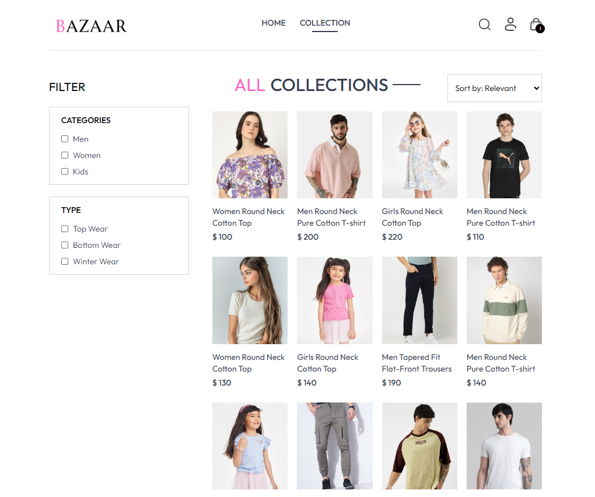
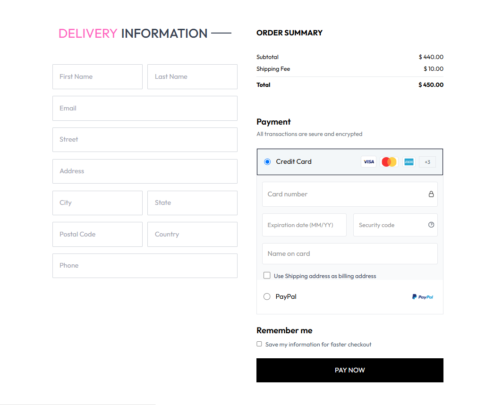

# Bazaar Ecommerce


A modern, responsive frontend ecommerce platform built with React and Tailwind CSS. This project showcases a complete online shopping experience with intuitive navigation, dynamic product displays, and a seamless checkout process.

📋 Project Overview
Bazaar is designed to provide users with an elegant and efficient shopping experience. The platform features a clean, minimalist design that puts products front and center while maintaining excellent performance across all devices.
The application follows modern React practices including component-based architecture, context API for state management, and responsive design principles. It demonstrates the implementation of common ecommerce functionalities including product filtering, search, cart management, and checkout flow.

## 🚀 Live Demo

[View Live Demo](https://bazaar-ecommerce.vercel.app) 

## ✨ Features

- **Responsive Design**: Fully optimized for all device sizes
- **Dynamic Product Catalog**: Browse through various product categories
- **Advanced Filtering**: Filter products by category, type, and more
- **Search Functionality**: Find products quickly with the search feature
- **Shopping Cart**: Add products, modify quantities, and view total
- **Product Details**: View detailed information with images and reviews
- **User Authentication**: Sign up and login functionality
- **Checkout Process**: Complete order placement with delivery details
- **Order History**: Track previous orders and their status
- **Local Storage**: Cart items are saved to local storage for persistence

## 📸 Screenshots

### Homepage with Hero Banner


### Latest Collections


### Product Collection Page with Filters


### Product Detail Page


### Shopping Cart


### Checkout Page


## 🛠️ Technologies Used

- **React**: Frontend library for building user interfaces
- **React Router DOM**: For navigation and routing
- **Context API**: For state management across components
- **Tailwind CSS**: For styling and responsive design
- **React Toastify**: For displaying notifications
- **LocalStorage API**: For persisting cart data

## 📦 Project Structure

```
bazaar-ecommerce/
├── public/
│   ├── images/
│   └── index.html
├── src/
│   ├── components/
│   │   ├── Cart/
│   │   ├── Home/
│   │   ├── Navbar/
│   │   ├── Product/
│   │   └── UI/
│   ├── context/
│   │   └── ShopContext.js
│   ├── pages/
│   │   ├── AboutPage.jsx
│   │   ├── CartPage.jsx
│   │   ├── CollectionsPage.jsx
│   │   ├── HomePage.jsx
│   │   ├── LoginPage.jsx
│   │   ├── OrdersPage.jsx
│   │   ├── PlaceOrderPage.jsx
│   │   └── ProductPage.jsx
│   ├── App.jsx
│   └── main.jsx
├── .gitignore
├── package.json
├── tailwind.config.js
├── vite.config.js
└── README.md
```

## 🚀 Getting Started

### Prerequisites

- Node.js (v14.0.0 or higher)
- npm or yarn

### Installation

1. Clone the repository
   ```bash
   git clone https://github.com/yourusername/bazaar-ecommerce.git
   cd bazaar-ecommerce
   ```

2. Install dependencies
   ```bash
   npm install
   # or
   yarn install
   ```

3. Start the development server
   ```bash
   npm run dev
   # or
   yarn dev
   ```

4. Open your browser and navigate to `http://localhost:{your port number}`

## 📝 Development Progress

### Completed Features

- ✅ Project setup with Tailwind CSS and React
- ✅ Responsive Navbar with hover menu
- ✅ Hero Banner
- ✅ Latest Collections component
- ✅ Best Sellers component
- ✅ Product filtering and sorting
- ✅ Search functionality
- ✅ Product detail page with images and tabs
- ✅ Add to cart feature
- ✅ Shopping cart page with quantity modification
- ✅ Checkout page with payment options
- ✅ Order history page
- ✅ Login/Signup page
- ✅ About us page
- ✅ Local storage for cart persistence

### In Progress

- 🔄 Backend development with Node.js
- 🔄 User authentication and authorization (JWT)
- 🔄 Payment gateway integration like Stripe and LemonSqueezy
- 🔄 Order processing system

### Future Possible Enhancements

- 📌 User dashboard
- 📌 Robust Login and Authentication
- 📌 Wishlist functionality
- 📌 Indepth Product reviews and ratings system
- 📌 Email notifications for orders
- 📌 Adding Products to a headless CMS or database

## 💡 Key Implementations

### Context API for State Management

```jsx
// ShopContext.js
import React, { createContext, useState, useEffect } from 'react';

export const ShopContext = createContext(null);

export const ShopContextProvider = (props) => {
  // State and functions implementation
  // ...
  
  const contextValue = {
    products,
    cart,
    addToCart,
    updateCartQuantity,
    getCartCount,
    getCartAmount,
    deliveryFee,
    showSearch,
    setShowSearch,
    search,
    setSearch,
    navigate
  };

  return (
    <ShopContext.Provider value={contextValue}>
      {props.children}
    </ShopContext.Provider>
  );
};
```

### Local Storage Implementation

```jsx
// Cart persistence with localStorage
useEffect(() => {
  const savedCart = localStorage.getItem('cart');
  if (savedCart) {
    setCart(JSON.parse(savedCart));
  }
}, []);

useEffect(() => {
  localStorage.setItem('cart', JSON.stringify(cart));
}, [cart]);
```


## 📄 License

This project is licensed under the MIT License - see the [LICENSE](LICENSE) file for details.


